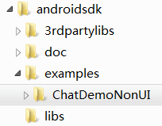
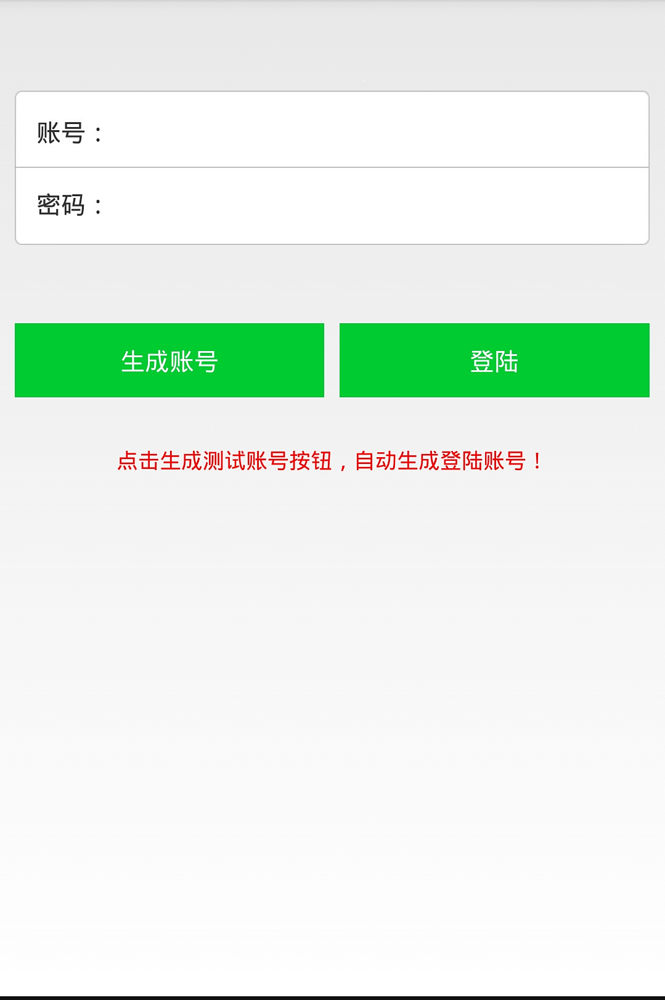
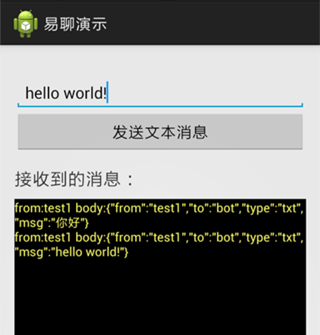
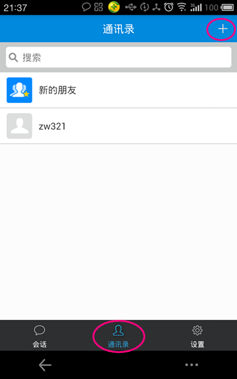
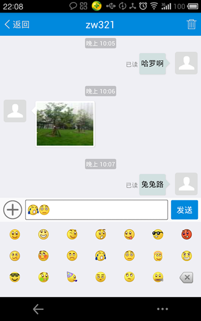
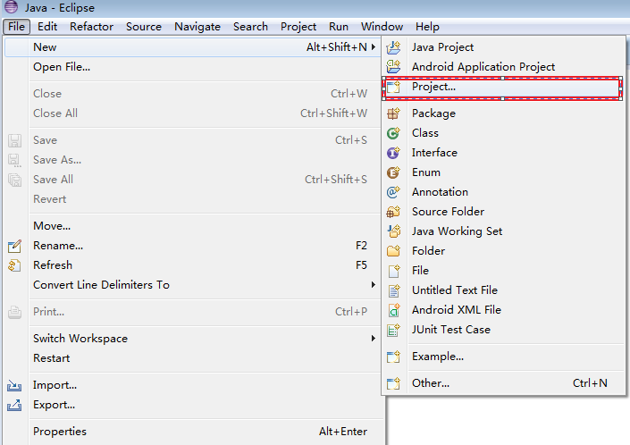

# 快速入门（五分钟运行环信demo) 

## 1.下载环信demo (Android) 

###  1.1 什么是环信demo

环信demo展示了怎样使用环信SDK快速创建一个完整的类微信聊天APP。展示的功能包括：环信SDK初始化，登录，登出，注册消息接收listener, 发送消息。

环信demo源代码已在github上开源供开发者下载，以帮助开发者更好的学习了解环信SDK。

### 1.2 下载环信sdk及demo 

    

1. 下载环信sdk及demo：[下载链接](http://www.easemob.com/downloads.php)

2. 解压缩easemob-sdk-2.0.0.zip后会得到以下目录结构：
 
 

## 2.运行环信demo (Android) 

###2.1 noui demo，此demo非常简单，登陆进去后进一个很简单的聊天页面
2.1.1 在手机上安装chatdemo-nonui.apk(apk位于androidsdk/examples/ChatDemoNonUI根目录下),安装成功后，运行chatdemo-nonui:点击生成账号按钮，系统将会为你自动创建一个临时账号

   
 
2.1.2 点击登陆按钮，进入应用中，点击“发送文本消息”，会发送消息给测试机器人（其账号为"bot"）。该测试机器人接收到消息后会把接收的消息原封不动的自动发送回来

 

###2.2 ui demmo，此demo比较复杂，包含了比较完整的聊天功能,包括发文字，表情，图片，语音，位置等。
 2.2.1 在手机上安装chatdemo-ui.apk(apk位于androidsdk/examples/ChatDemoUI根目录下)，安装成功后，运行此app，使用nonui生成的账号，或者在此app中注册账号,生成的账号在两个demo中都能使用。
 2.2.2 登陆之后，进入通讯录点击右上角的加号，添加好友成功后，就可以互发消息了。
  
	
###2.3 导入demo源代码到eclipse查看运行demo
2.3.1 导入demo到eclipse，从解压后easemob-sdk-2.0.0.zip文件夹下的libs文件下easemobchat_2.0.0.jar和3rdpartylibs文件夹下httpmime-4.2.jar拷贝到demo的libs底下
 

## 3.快速集成(Android) ##

### 3.1 把libs文件夹下easemobchat_2.0.0.jar和3rdpartylibs文件夹下httpmime-4.2.jar拷贝到你的项目的libs文件夹底下。###

 

### 3.2. 在清单文件AndroidManifest.xml里加入以下权限，以及写上你注册的appkey

		<uses-permission android:name="android.permission.VIBRATE" />
	    <uses-permission android:name="android.permission.INTERNET" />
	    <uses-permission android:name="android.permission.ACCESS_NETWORK_STATE" />
	    <uses-permission android:name="android.permission.WRITE_EXTERNAL_STORAGE" />
	    <uses-permission android:name="android.permission.GET_TASKS" />
	    <uses-permission android:name="android.permission.ACCESS_WIFI_STATE" />
		
		<!--  设置环信SDK的appkey -->
	    <meta-data android:name="EASEMOB_APPKEY"  android:value="你申请的appkey" />

关于EASEMOB_APPKEY，请登录或注册环信开发者(http://www.easemob.com),登陆管理后台,申请APPKEY后，进行相关配置。（测试APPKEY为chatdemo）

## 4. 从源代码级别深入了解环信demo (Android)

 
### 4.1 在Eclipse/IDEA中创建环信demo project 

1. Eclipse IDE： 打开菜单“ File - New - Project“，选择”Android Project from Existing Code”， 选择解压后的"androidsdk/examples"目录下的chatdemo-nonui路径,点击“Finish”。

### 4.2. 深入理解环信demo背后的代码 ###

#### 1.初始化： 见DemoApplication.java

    public class DemoApplication extends Application {
    
        public static Context appContext;
        @Override
        public void onCreate() { 
           super.onCreate();
           appContext = this;
     
           //初始化环信SDK
           Log.d("DemoApplication", "Initialize EMChat SDK");
           EaseMobChat.getInstance().init(appContext);
        }
    }

#### 2. 注册：见LoginActivity.java ####

	// 注册临时账号  缺省密码： 123456
	register.setOnClickListener(new OnClickListener() {
		@Override
		public void onClick(View v) {
			account.setText(getAccount());
			pwd.setText("123456");
			CreateAccountTask task = new CreateAccountTask();
			task.execute("chatdemo_" + account.getText().toString(), "123456", "chatdemo");

			}
		});
	}

	private class CreateAccountTask extends AsyncTask<String, Void, String> {
		protected String doInBackground(String... args) {
			String userid = args[0];
			String pwd = args[1];
			String channel = args[2];
			try {//channel即为APPKEY
				EMChatManager.getInstance().createAccountOnServer(userid, pwd, channel);
			} catch (Exception e) {
				e.printStackTrace();
			}
			return userid;
		}
	}

#### 3. 登陆：见LoginActivity.java ####

    @Override
    protected void onResume() {
        super.onResume();
        //登陆到聊天服务器,此处使用注册的临时账号作为登陆账号
        EMChatManager.getInstance().login(username, password, new EMCallBack() {

            @Override
            public void onError(int arg0, final String errorMsg) {
                runOnUiThread(new Runnable() {
                    public void run() {
                        Toast.makeText(MainActivity.this, "登录聊天服务器失败：" + errorMsg, Toast.LENGTH_SHORT).show();
                    }
                });
            }

            @Override
            public void onProgress(int arg0, String arg1) {
            }

            @Override
            public void onSuccess() {
                runOnUiThread(new Runnable() {
                    public void run() {
                        Toast.makeText(MainActivity.this, "登录聊天服务器成功", Toast.LENGTH_SHORT).show();
                    }
                });
                
            }
        });
    }

#### 4. 注册listener,以接收聊天消息：见MainActivity.java ####

    @Override
    protected void onCreate(Bundle savedInstanceState) {

        //注册message receiver， 接收聊天消息
        msgReceiver = new NewMessageBroadcastReceiver();
        IntentFilter intentFilter = new IntentFilter(EMChatManager.getInstance().getNewMessageBroadcastAction());
        registerReceiver(msgReceiver, intentFilter);
    }

#### 5. 发送消息：见MainActivity.java ####

    //本demo是发送消息给测试机器人（其账号为"bot"）。该测试机器人接收到消息后会把接收的消息原封不动的自动发送回来
    public void onSendTxtMsg(View view) {
        try {
            //创建一个消息
            EMMessage msg = EMMessage.createSendMessage(EMMessage.Type.TXT);
            //设置消息的接收方
            msg.setReceipt("bot");
            //设置消息内容。本消息类型为文本消息。
            TextMessageBody body = new TextMessageBody(tvMsg.getText().toString());
            msg.addBody(body);
        
            //发送消息
            EMChatManager.getInstance().sendMessage(msg);
            Log.d("chatdemo", "消息发送成功:" + msg.toString());
        } catch (Exception e) {
            e.printStackTrace();
        }
    }

#### 6. 接收聊天消息并显示：见MainActivity.java ####

    private class NewMessageBroadcastReceiver extends BroadcastReceiver {
        @Override
        public void onReceive(Context context, Intent intent) {
            //消息id
            String msgId = intent.getStringExtra("msgid");
            //消息发送方
            String msgFrom = intent.getStringExtra("from");
            //消息类型
            int msgType = intent.getIntExtra("type", 0);
            //消息内容
            String msgBody = intent.getStringExtra("body");
            
            Log.d("chatdemo", "new message id:" + msgId + " from:" + msgFrom + " type:" + msgType + " body:" + msgBody);
            
            tvReceivedMsg.append("from:" + msgFrom + " body:" + msgBody + " \r");
        }
    }

#### 7. 退出登陆：见MainActivity.java ####

    @Override
    protected void onPause() {
        super.onPause();
        
        //登出聊天服务器
        EMChatManager.getInstance().logout();
    }

<!-- # 4. 环信demo源代码 

 
环信提供了一系列demo以帮助开发者更好的学习了解环信SDK。所有demo均已在github上开源供开发者下载使用。你可以clone这些项目来学习了解环信SDK，也可以在这些demo基础上快速创建你自己的真正项目。环信SDK（Android版）在github的下载地址是：

[https://github.com/easemob/sdkexamples-android](https://github.com/easemob/sdkexamples-android)-->

# 5. Bug报告跟踪 #

请使用以下地址来报告跟踪bug：

[https://github.com/easemob/sdkexamples-android/issues](https://github.com/easemob/sdkexamples-android/issues)

