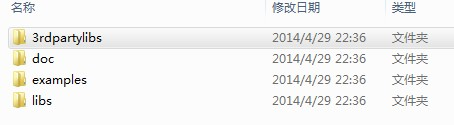
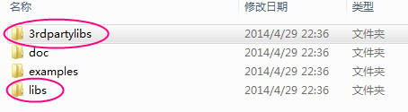
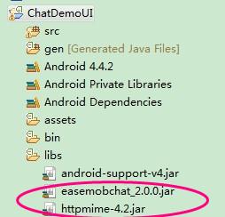

# 快速入门（五分钟运行环信demo) 

## 1.下载环信demo (Android) 

###  1.1 环信UI demo

 UI demo，此demo比较复杂，包含了一个接近微信的完整的聊天app的所有功能,包括发文字，表情，图片，语音，位置，群聊，登录，注册，退出登录等。

环信UI demo源代码已在github上开源供开发者下载，以帮助开发者更好的学习了解环信SDK。

### 1.2 下载环信sdk及demo 

    

1. 下载环信sdk及demo：[下载链接](http://www.easemob.com/downloads.php)

2. 解压缩easemob-sdk-2.0.0.zip后会得到以下目录结构：
 
 

## 2.运行环信demo (Android) 

2.1 在手机上安装chatdemo-ui.apk(apk位于androidsdk/examples/ChatDemoUI根目录下)，安装成功后，运行此app，注册账号。

2.2 登陆之后，进入通讯录点击右上角的加号，添加好友成功后，就可以互发消息了。

  
	
2.3 导入demo源代码到eclipse查看运行demo
从examples目录下导入相应demo到eclipse，把libs文件下easemobchat_2.0.0.jar和3rdpartylibs文件夹下httpmime-4.2.jar拷贝到demo的libs底下

  

## 3.快速集成(Android) ##

### 3.1 把libs文件夹下easemobchat_2.0.0.jar和3rdpartylibs文件夹下httpmime-4.2.jar拷贝到你的项目的libs文件夹底下。###

 

### 3.2. 在清单文件AndroidManifest.xml里加入以下权限，以及写上你注册的appkey

	<uses-permission android:name="android.permission.VIBRATE" />
    <uses-permission android:name="android.permission.INTERNET" />
    <uses-permission android:name="android.permission.RECORD_AUDIO" />
    <uses-permission android:name="android.permission.CAMERA" />
    <uses-permission android:name="android.permission.ACCESS_NETWORK_STATE" />
    <uses-permission android:name="android.permission.ACCESS_MOCK_LOCATION" />
    <uses-permission android:name="android.permission.WRITE_EXTERNAL_STORAGE" />
    <uses-permission android:name="android.permission.MOUNT_UNMOUNT_FILESYSTEMS"/>  
    <uses-permission android:name="android.permission.ACCESS_FINE_LOCATION" />
    <uses-permission android:name="android.permission.CALL_PHONE" />
    <uses-permission android:name="android.permission.GET_TASKS" />
    <uses-permission android:name="android.permission.ACCESS_WIFI_STATE" />
    <uses-permission android:name="android.permission.CHANGE_WIFI_STATE" />
    <uses-permission android:name="android.permission.WAKE_LOCK" />
    <uses-permission android:name="android.permission.MODIFY_AUDIO_SETTINGS" />
    <uses-permission android:name="android.permission.READ_PHONE_STATE" />
    
	<permission android:name="android.permission.BAIDU_LOCATION_SERVICE" />
		
		<!--  设置环信SDK的appkey -->
	<meta-data android:name="EASEMOB_APPKEY"  android:value="你申请的appkey" />
	<service android:name="com.easemob.chat.EMChatService" />

关于EASEMOB_APPKEY，请登录或注册环信开发者(http://www.easemob.com),登陆管理后台,申请APPKEY后，进行相关配置。（测试APPKEY为chatdemo）

## 4. 从源代码级别深入了解环信demo (Android)

 
### 4.1 在Eclipse/IDEA中创建环信demo project 

1. Eclipse IDE： 打开菜单“ File - New - Project“，选择”Android Project from Existing Code”， 选择解压后的"androidsdk/examples"目录下的chatdemo-nonui路径,点击“Finish”。

### 4.2. 深入理解环信demo背后的代码 ###

#### 1.初始化： 见DemoApplication.java

    public class DemoApplication extends Application {
    
        public static Context appContext;
        @Override
        public void onCreate() { 
           super.onCreate();
           appContext = this;
     
           //初始化环信SDK
           Log.d("DemoApplication", "Initialize EMChat SDK");
           EMChat.getInstance().init(appContext);

		//获取到EMChatOptions对象
        EMChatOptions options = EMChatManager.getInstance().getChatOptions();
        // 默认添加好友时，是不需要验证的，改成需要验证
        options.setAcceptInvitationAlways(false);
        //设置收到消息是否有新消息通知，默认为true
        options.setNotificationEnable(false);
        //设置收到消息是否有声音提示，默认为true
        options.setNoticeBySound(false);
        //设置收到消息是否震动 默认为true
        options.setNoticedByVibrate(false);
        //设置语音消息播放是否设置为扬声器播放 默认为true
        options.setUseSpeaker(false);

        }
    }

#### 2. 注册：见RegisterActivity.java ####

	final String appkey = EMChatConfig.getInstance().APPKEY;
			new Thread(new Runnable() {
				public void run() {
					try {
						//调用sdk注册方法
						EMChatManager.getInstance().createAccountOnServer(appkey + "_" + username, pwd);
						
					} catch (final Exception e) {
					
					}
				}
			}).start();

#### 3. 登陆：见LoginActivity.java ####

   	//调用sdk登陆方法登陆聊天服务器
	EMChatManager.getInstance().login(username, password, new EMCallBack() {
				
		@Override
		public void onSuccess() {
			// TODO Auto-generated method stub
					
		}
				
		@Override
		public void onProgress(int progress, String status) {
			// TODO Auto-generated method stub
					
		}
				
		@Override
		public void onError(int code, String message) {
			// TODO Auto-generated method stub
					
		}
	});

#### 4. 注册listener,以接收聊天消息,回执消息，好友同意，好友请求等监听变化：见MainActivity.java ####

 		//注册一个接收消息的BroadcastReceiver
		msgReceiver = new NewMessageBroadcastReceiver();
		IntentFilter intentFilter = new IntentFilter(EMChatManager.getInstance().getNewMessageBroadcastAction());
		intentFilter.setPriority(3);
		registerReceiver(msgReceiver, intentFilter);

		// 注册一个ack回执消息的BroadcastReceiver
		IntentFilter ackMessageIntentFilter = new IntentFilter(EMChatManager.getInstance().getAckMessageBroadcastAction());
		ackMessageIntentFilter.setPriority(3);
		registerReceiver(ackMessageReceiver, ackMessageIntentFilter);
		
		//注册一个好友请求同意好友请求等的BroadcastReceiver
		IntentFilter inviteIntentFilter = new IntentFilter(EMChatManager.getInstance().getContactInviteEventBroadcastAction());
		registerReceiver(contactInviteReceiver, inviteIntentFilter);
		
		//setContactListener监听联系人的变化等
		EMContactManager.getInstance().setContactListener(new MyContactListener());
		//注册一个监听连接状态的listener
		EMChatManager.getInstance().addConnectionListener(new MyConnectionListener());
    }

#### 5. 好友请求，好友同意：见MainActivity.java ####

   private BroadcastReceiver contactInviteReceiver = new BroadcastReceiver(){

		@Override
		public void onReceive(Context context, Intent intent) {
			//请求理由
			final String reason = intent.getStringExtra("reason");
			final boolean isResponse = intent.getBooleanExtra("isResponse", false);
			//消息发送方username
			final String from = intent.getStringExtra("username");
			
			//接到邀请的消息，如果不处理(同意或拒绝)，掉线后，服务器会自动再发过来，所有客户端不要重复提醒
			
					
			//sdk暂时只提供同意好友请求方法，不同意选项可以参考微信增加一个忽略按钮。
		
			//提示有新消息
			EMNotifier.getInstance(getApplicationContext()).notifyOnNewMsg();
			
			
			abortBroadcast();
			
		}
		
	};

#### 6. 接收聊天消息并显示：见MainActivity.java ####

    private class NewMessageBroadcastReceiver extends BroadcastReceiver {
        @Override
        public void onReceive(Context context, Intent intent) {
            //消息id
            String msgId = intent.getStringExtra("msgid");
            ......
			......
			......

			//注销广播，否则在ChatActivity中会收到这个广播
			abortBroadcast();
        }
    }

#### 7. 消息回执BroadcastReceiver：见MainActivity.java ####

    private BroadcastReceiver ackMessageReceiver = new BroadcastReceiver() {
		
		@Override
		public void onReceive(Context context, Intent intent) {
			 //消息id
            String msgId = intent.getStringExtra("msgid");
            ......
			......
			......

			abortBroadcast();
		}
	};

#### 8.联系人变化listener：见MainActivity.java ####

    private class MyContactListener implements EMContactListener{

		@Override
		public void onContactAdded(List<String> usernameList) {
			
			
		}

		@Override
		public void onContactDeleted(List<String> usernameList) {
			
		}

		
	}

#### 9.监听连接状态：见MainActivity.java ####

    private class MyConnectionListener implements ConnectionListener{

		@Override
		public void onConnected() {
			
		}

		@Override
		public void onDisConnected(String errorString) {
			
		}

		@Override
		public void onReConnected() {
			
		}

		@Override
		public void onReConnecting() {
		}

		@Override
		public void onConnecting(String progress) {
		}
		
	}

#### 10. 退出登陆：见MainActivity.java ####

    @Override
    protected void onPause() {
        super.onPause();
        
        //登出聊天服务器
        EMChatManager.getInstance().logout();
    }

# 5. 环信demo源代码git地址

 
环信提供了一系列demo以帮助开发者更好的学习了解环信SDK。所有demo均已在github上开源供开发者下载使用。你可以clone这些项目来学习了解环信SDK，也可以在这些demo基础上快速创建你自己的真正项目。环信SDK（Android版）在github的下载地址是：

[https://github.com/easemob/sdkexamples-android](https://github.com/easemob/sdkexamples-android)

# 6. Bug报告跟踪 #

请使用以下地址来报告跟踪bug：

[https://github.com/easemob/sdkexamples-android/issues](https://github.com/easemob/sdkexamples-android/issues)

