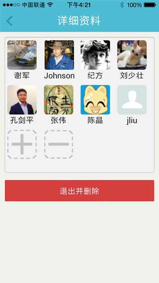

# UI模板

#1 会话

##1.1 会话列表

**会话列表，是发起会话、查看会话历史记录的入口，支持联系人搜索。**

##1.2 单聊(语音)

**会话功能支持语音发送，点击“按住说话”按钮，可记录语音信息，松开按钮，信息自动发送给对方。**

##1.3 单聊详情（富媒体）##

**会话功能支持富媒体，用户可在会话聊天页面中点击“+”号，展开富媒体模式（图片、拍照、位置、名片、视频），从中选择想要发送的信息类型。**

##1.4 群组列表

**支持群聊功能，用户可拉人组建群组，在群组内开展群聊，群组可自设名称表明该群组的主题或目的属性。**

##1.5 群聊成员管理

**用户可点击“+”或“-”号来增加或减少群组内成员。或选择退出群组。**

#2 通讯录

##2.1 通讯录列表

**通讯录中可发起聊天，管理好友（添加、修改、删除）；支持按企业架构进行人员分组；可轻松创建工作组发起群聊。**

##2.2 联系人详情

**联系人详情页中可发起聊天，编辑联系人信息。**

