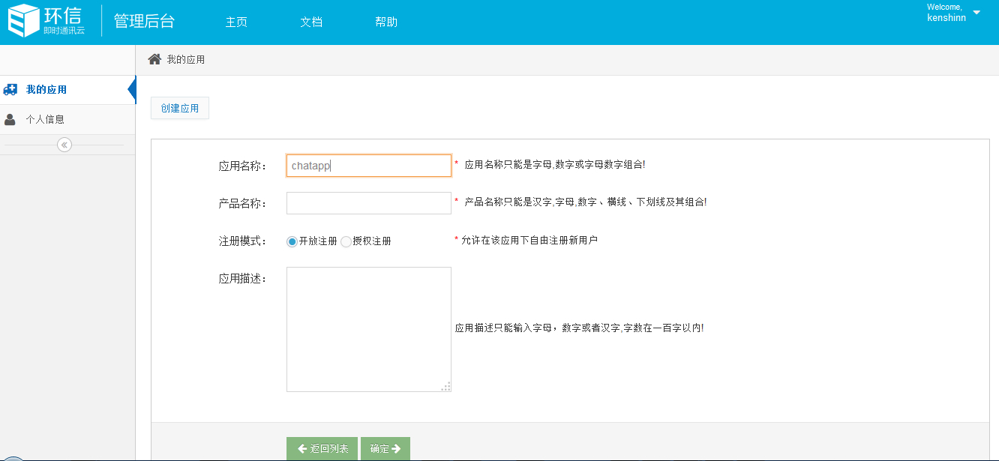
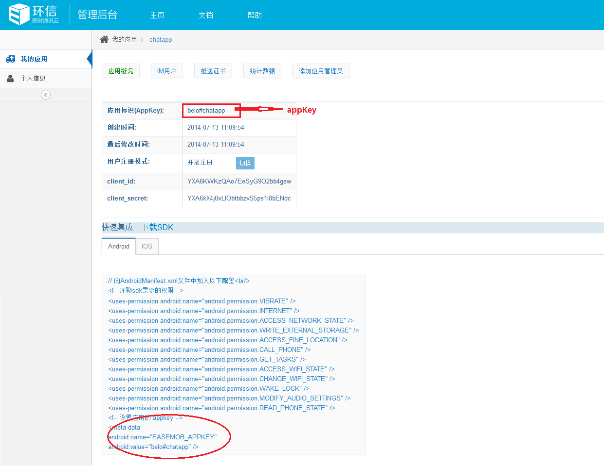

## 新手指引

 环信即时通讯云是移动即时通讯能力的云计算 PaaS (Platform as a Service, 平台即服务) 平台服务商。为此，我们为广大开发者提供了基于互联网和移动终端的单聊，群聊，富媒体消息，实时语音，实时视频，多人语音视频，流媒体播放及互动等通讯能力的相关SDK,帮助开发者快速集成到自己的APP当中，另外我们提供了开放的API接口文档，以供参考。

## 1.环信开发者

###  1.1注册账号

在环信官网上点击[登录/注册](http://www.easemob.com/)，跳转到环信管理后台登录页面（如果您已注册过，直接登录），在后台登录页面，点击注册按钮，进行注册，如下图：

在注册页面中填写详细资料（企业ID，只限于数字,字母,横线,且不能以横线开头和结尾！），如下图：

（企业ID会存在于生成的APPKEY中，如：测试demo中 APPKEY为*easemob-demo#chatdemo*，则easemob-demo为填写的企业ID）

注：如果是个人应用开发的话，企业ID直接写成自己定义的ID就可以

点击注册，注册成功后，我们会向您填写的邮箱中发送验证信息，请前往邮箱进行账号激活。如下图：

账号激活成功后，回到控制台登录页面登录到开发者后台,在我的应用中，点击创建应用按钮，如下图：

填写创建应用的名称(内容只限于数字，大小写字母)，如下图：

（应用名称会存在于你生成的APPKEY中，如：测试demo中 APPKEY为*easemob-demo#chatdemo*，则chatdemo为填写的应用名称。注册授权根据需要自行选择）

填写好应用名称后，点确定，创建成功，系统会为你生成APPKEY以及相关配置信息，如下图：

## 2.APP应用集成

2.1 [5分钟快速入门-android](/docs/emchat/android/quickstartUI.html)

2.2 [5分钟快速入门-ios](/docs/emchat/ios/quickstart.html)
