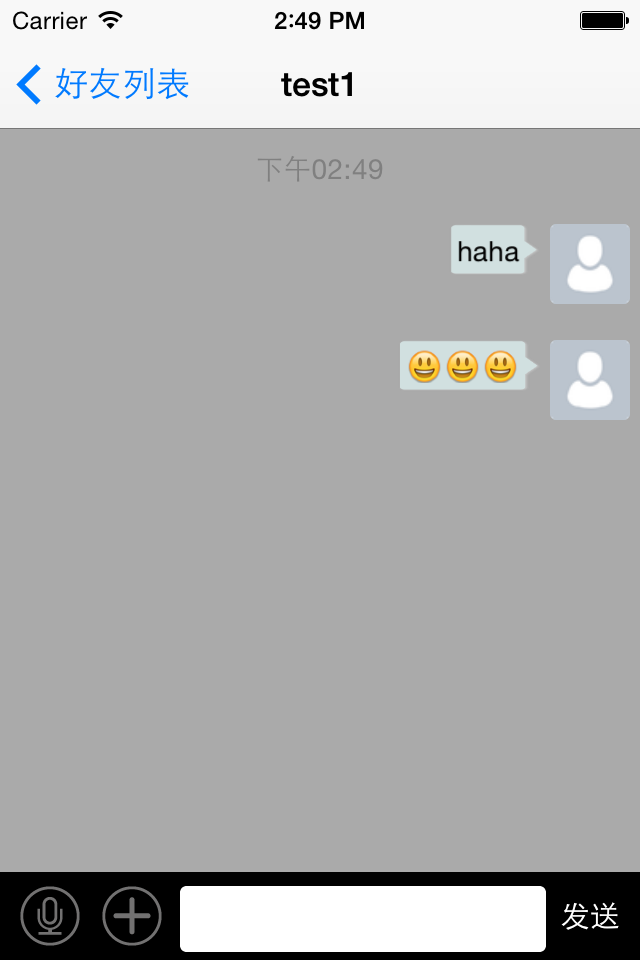
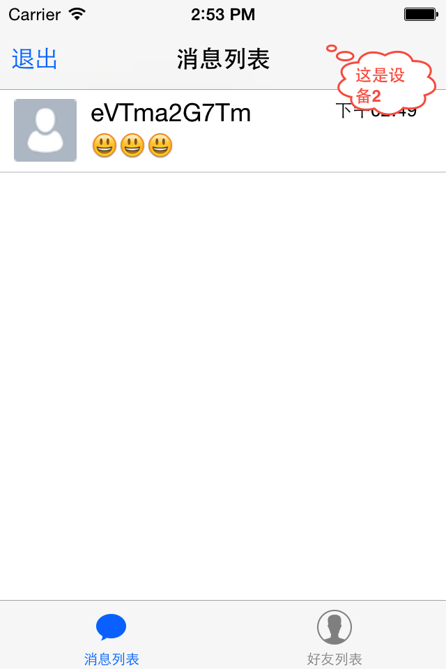

# EaseMob集成示例操作流程 #

## 有聊天页面的Demo##

### Demo说明 ###

#### 1.提供测试的AppKey(ChatDemo) ####

#### 2.登陆页面提供自动生成账号操作，每个登陆账号提供4个测试好友（用户名test1~4，密码123456）####

#### 3.需要2台设备，其中一台登陆自动生成的账号，另一台设备登陆test~4其中一个，两者互发消息 ####

#### 4.友情提示：不要频繁的注册账号，会被返回“注册失败”的 ####

### Demo演示流程 ###

#### 1.下载环信UIDemo：[下载链接](http://www.easemob.com/downloads/IOSDemo.zip)####

  
  
#### 2.首先是设备1，在设备1上运行程序，点击“自动生成”按钮，程序会自动生成账号和密码并注册、登陆 ####

 
 
#### 3.登陆成功进入首页,进入“好友列表”，给要对聊的测试账号发送消息 ####

 
 
#### 4.接下来是设备2了，在设备2上运行程序并登陆测试账号（设备1对聊的账号，不要点击自动生成） ####

 
 
#### 5.用设备1给设备2发送的消息，会在设备2的“消息列表”页面显示出来。OK了，你可以互发一下试试 ####

 
 
 