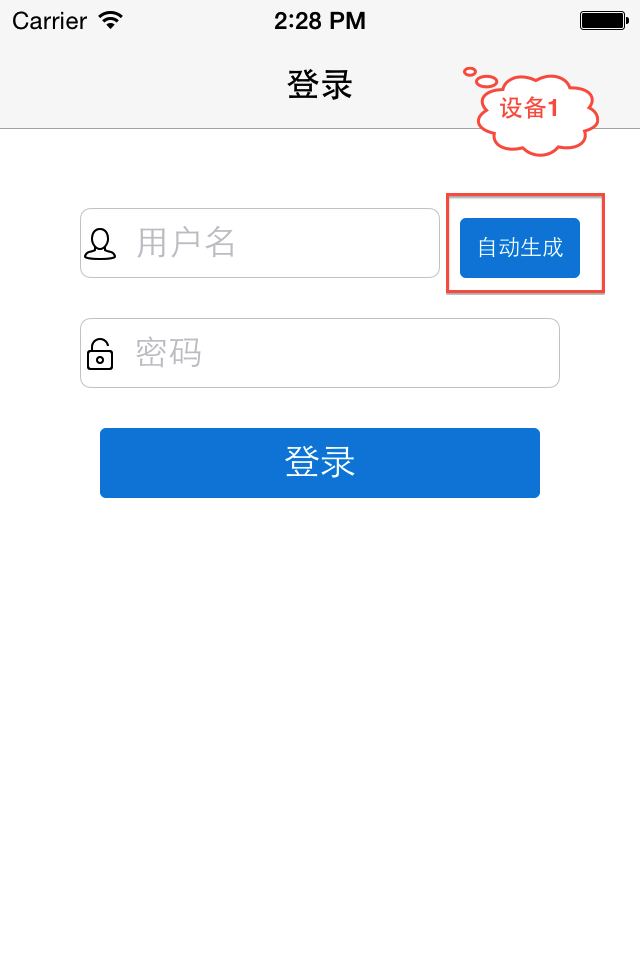
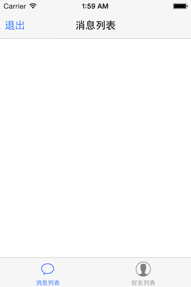
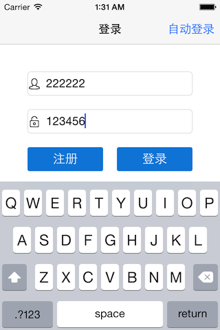
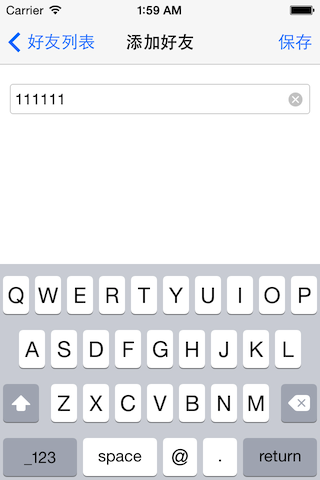
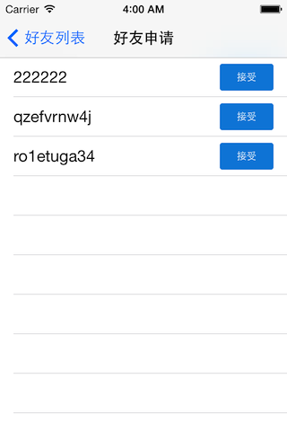
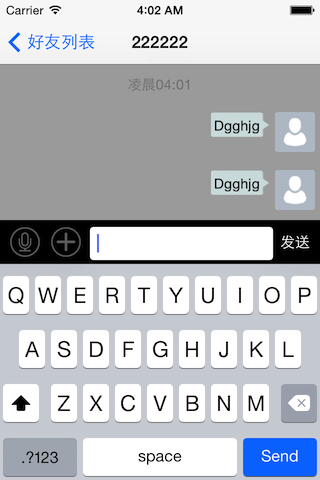

# EaseMob集成示例操作流程 #

## 有聊天页面的Demo##

### Demo说明 ###

#### 1.提供测试的AppKey(easemob-demo#chatdemoui) ####

#### 2.登录页面提供 a).自动登录(密码统一为123456)；b).注册和登录####

#### 3.需要至少2个账号，互加好友，互发消息 ####

#### 4.友情提示：不要频繁的注册账号，会被返回“注册失败”的 ####

### Demo演示流程 ###

#### 1.下载Demo：[http://www.easemob.com/downloads.php] ####

  
  
#### 2.运行程序，可以手动输入用户名和密码进行注册；也可以点击“自动生成”按钮，程序会自动生成账号和密码并注册、登录 ####

 
 
#### 3.登录成功进入首页 ####

 
 
#### 4.接下来是另一个账号，运行程序并登录账号2（账号1对聊的账号，不要点击自动生成，单个设备的也可以退出当前账号，注册并登录账号2）,进入“好友列表”，点击“添加好友”，输入好友用户名（账号1） ####

 
 
 
 
#### 5.账号1的好友列表页面，点击“新的好友”，会看到账号2发来的好友请求，接受后，账号2会成为账号1的好友 ####

 
 
#### 6.ok了，账号1和账号2可以互发消息 ####

 