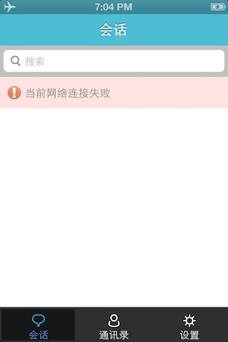

# EaseMob集成示例操作流程 #

## 有聊天页面的Demo##

### Demo说明 ###

#### 1.提供测试的AppKey(easemob-demo#chatdemoui) ####

#### 2.需要至少2个账号，互加好友，互发消息 ####

### Demo演示流程 ###

#### 1.下载环信Demo及SDK： [下载](http://www.easemob.com/downloads.php) ####

  
  
#### 2.运行程序 ####
**账号不支持中文**

 
 
#### 3.登录成功进入首页 ####
**会话：聊天的会话列表**

**通讯录：申请通知，群组，好友列表**

**设置：退出登录**

 
 
#### 4.添加好友 ####
**运行程序并登录账号2。点击“通讯录”页面的“+”**

 
 
 **输入好友用户名（账号1），进行搜索添加**
 
 
 
 **在账号1接收账号2的好友申请**
 
 
 
#### 5.ok了，账号1和账号2可以互发消息 ####

  
 
### 其他说明 ###
#### 1.监测网络状态 ####
**在MainViewController类中有体现，监测以下方法**

	#pragma mark - IChatManagerDelegate 登录状态变化

	- (void)didConnectionStateChanged:(EMConnectionState)connectionState
	{
    	
	}
	
 
