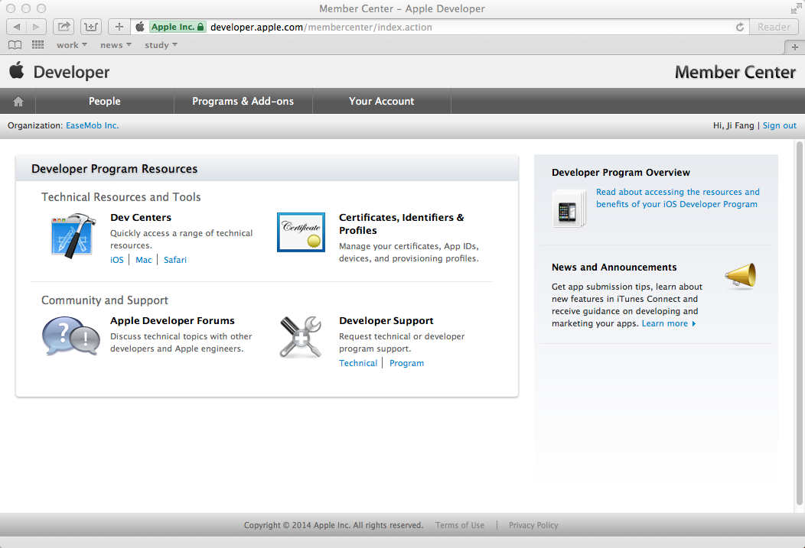
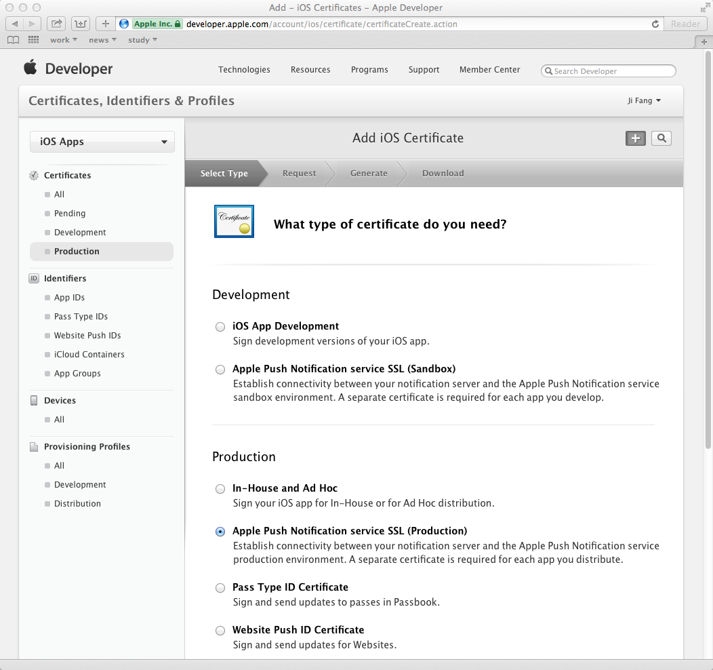
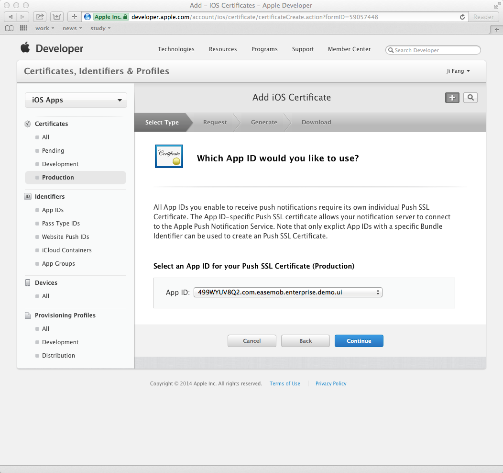
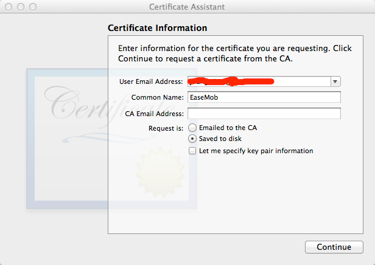
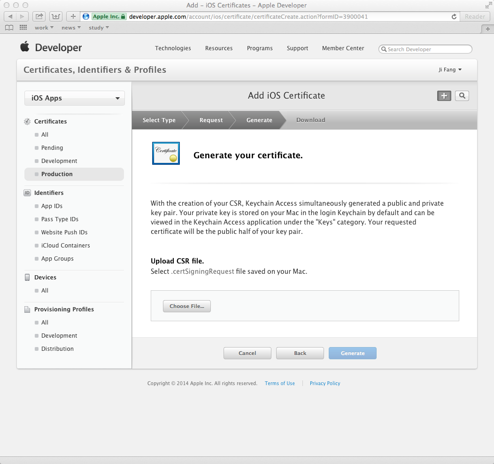
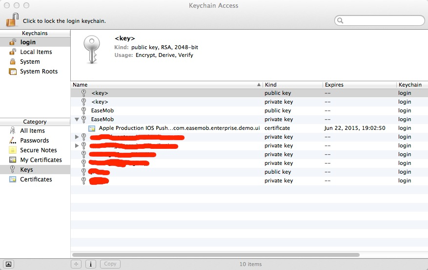
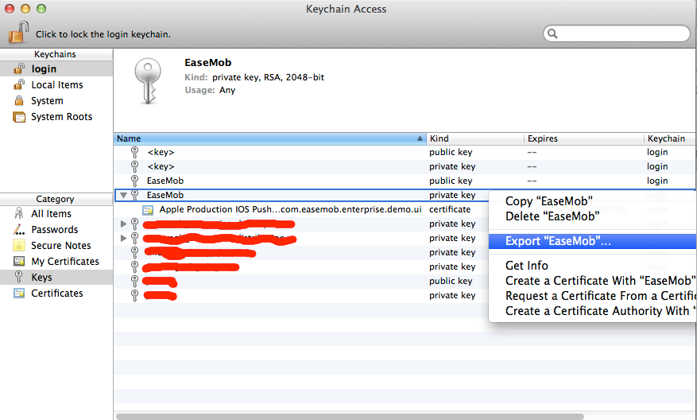
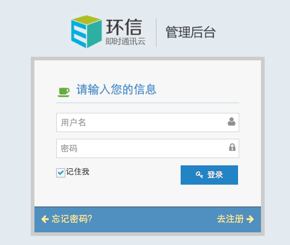
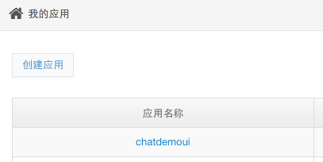
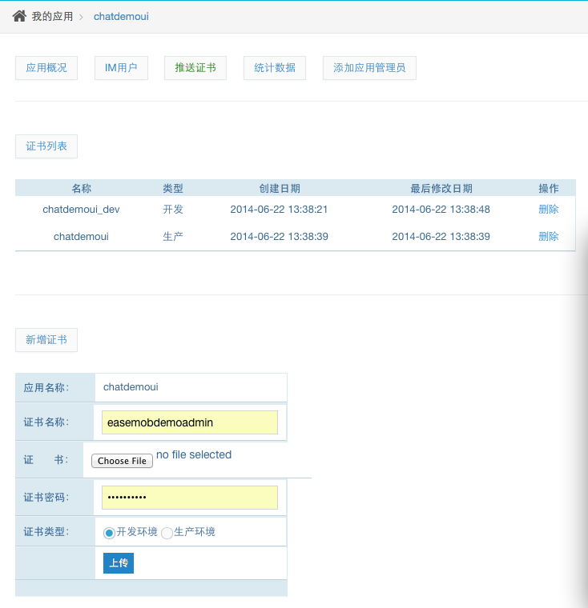

# 制作iOS推送证书

## 让您的APP支持推送消息,您需要对推送证书做些简单设置,步骤如下:

### 1. 制作推送证书

#### 1.1. 打开苹果开发者网站[*http://developer.apple.com*](http://developer.apple.com/)

#### 1.2. 从Member Center进入*Certificates, Identifiers & Profiles*

#### 1.3. 选择要制作的推送证书

对于开发环境(sandbox)的推送证书, 请选择*Apple Push Notification service SSL (Sandbox)*  
对于生产环境(production)的推送证书, 请选择*Apple Push Notification service SSL (Production)*

#### 1.4. 选择对应的APP ID, 以ChatDemoUI为例, 此处我们选择*com.easemob.enterprise.demo.ui*

#### 1.5. 根据Certificate Assistant的提示, 创建Certificate Request

#### 1.6. 上传1.5中创建的Certificate Request文件

#### 1.7. 上传完毕后, 推送证书就被正确生成了, 之后我们下载下来这个证书, 并双击导入系统

### 2. 导出证书文件, 并上传到环信管理后台
#### 2.1. 打开Application --> Utilities --> Keychain Access应用, 我们会看到有刚刚我们制作好的推送证书

#### 2.2. 选中证书对应的私钥(或者展开后选中证书), 点右键, 选择导出, 并设定密码

### 3. 在环信管理后台进行设置
#### 3.1. 登陆环信管理后台[*http://console.easemob.com*](http://console.easemob.com/)

#### 3.2. 输入了正确的账号后, 选择对应的APP, 仍以ChatDemoUI为例, 点击ChatDemoUI

#### 3.3. 填写的证书名称(只是个有意义的名字, 对推送并不直接相关), 并上传之前导出的P12文件, 密码则为此P12文件的密码, 证书类型请根据具体情况选择(创建的是Apple Push Notification service SSL Sandbox请选择*开发环境*; Apple Push Notification service SSL Production请选择*生产环境*), 上传证书

### 4. 在APP源代码中进行最后的设置
#### 4.1. 在调用*[[EaseMob sharedInstance] registerSDKWithAppKey:@"easemob-demo#chatdemoui" apnsFilename:apnsFilename];*的这句里, 把证书文件名传进来(不包含扩展名.p12). 比方说导出的证书文件名是*chatdemo_push_cert.p12*, 则apnsFilename应为*chatdemo_push_cert*

#### 4.2. 编译, 运行