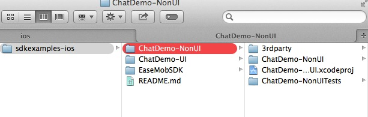
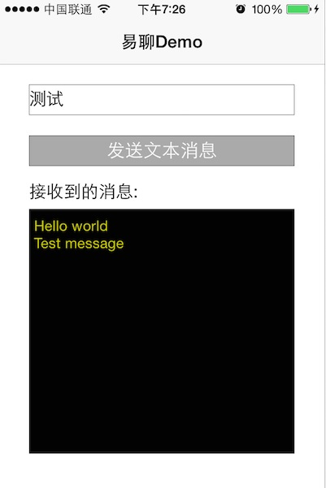

# 快速入门（五分钟运行易聊demo) 

## 1.下载易聊demo (iOS) 

###  1.1 什么是易聊demo

易聊demo展示了怎样使用易聊SDK快速创建一个完整的类微信聊天APP。展示的功能包括：易聊SDK初始化，登录，登出，注册消息接收listener, 发送消息

易聊demo源代码已在github上开源供开发者下载，以帮助开发者更好的学习了解易聊SDK。

### 1.2 下载易聊demo 

    

1. 下载易聊demo：[下载链接](#{site.base_url}/docs/downloads/downloads.html)

2. 解压缩iOSsdk.zip后会得到以下目录结构：
 
 

## 2.运行易聊demo (iOS) 

1. 在手机上安装chatdemo-nonui.ipa
    
 
2. 运行chatdemo-nonui: 点击“发送文本消息”，会发送消息给测试机器人（其账号为"bot"）。该测试机器人接收到消息后会把接收的消息原封不动的自动发送回来

 

## 3. 从源代码级别深入了解易聊demo (iOS)

### 3.1. 深入理解易聊demo背后的代码 ###

#### 1.注册listener,以接收聊天消息:RootViewController.m

    [[EaseMob sharedInstance].chatManager addDelegate:self
                                        delegateQueue:nil];

#### 2. 登录：见RootViewController+Login.m ####

	//使用测试帐号 test1 密码为123456
    [[EaseMob sharedInstance].userManager asyncLoginWithUsername:@"test1"
                                                        password:@"123456"
                                                      completion:^(NSDictionary *loginInfo,
                                                                   EMError *error) {
                                                          [self hideHud];
                                                          if (error) {
                                                              NSLog(@"登录失败");
                                                          }else {
                                                              NSLog(@"登录成功");
                                                          }
                                                      } onQueue:nil];

#### 3. 退出登录：见RootViewController+Login.m ####

	[[EaseMob sharedInstance].userManager asyncLogoff];

#### 4. 发送消息：见RootViewController+sendChat.m ####

    //本demo是发送消息给测试机器人（其账号为"bot"）。该测试机器人接收到消息后会把接收的消息原封不动的自动发送回来
    EMChatText *text = [[EMChatText alloc] initWithText:message];
    EMMessageBody *body = [[EaseMob sharedInstance].chatManager createTextMessageBody:text];
    NSString *myUsername = [[[EaseMob sharedInstance].userManager loginInfo]
                            objectForKey:kUserLoginInfoUsername];
    EMMessage *msg = [[EMMessage alloc] initWithSender:myUsername
                                              receiver:@"bot"
                                                bodies:[NSArray arrayWithObject:body]];
    
    [[EaseMob sharedInstance].chatManager sendMessage:msg
                                             progress:nil
                                                error:nil];

#### 5. 接收聊天消息并显示：见RootViewController.m ####

	-(void)didReceiveMessage:(EMMessage *)message{
    	for (EMMessageBody *body in message.messageBodies) {
     	   if (body.messageType == eMessageType_Text) {
      	      _textView.text = ((EMTextMessageBody *)body).text;
      	      break;
      	  }
   		}
	}

# 4. 易聊demo源代码 

 
易工厂提供了一系列demo以帮助开发者更好的学习了解易聊SDK。所有demo均已在github上开源供开发者下载使用。你可以clone这些项目来学习了解易聊SDK，也可以在这些demo基础上快速创建你自己的真正项目。易聊SDK（iOS版）在github的下载地址是：

    [https://github.com/easemob/sdkexamples-android](https://github.com/easemob/sdkexamples-android)

# 5. Bug报告跟踪 #

请使用以下地址来报告跟踪bug：

https://github.com/easemob/sdkexamples-android/issues

