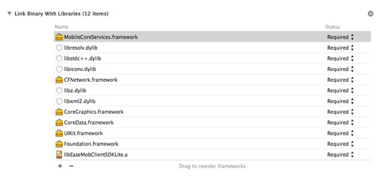

# 快速入门（五分钟运行环信demo)  

## 1.下载环信demo (iOS) ##

###  1.1 什么是环信demo ###

环信demo展示了怎样使用环信SDK快速创建一个完整的类微信聊天APP。展示的功能包括：环信SDK初始化，登录，登出，注册消息接收listener, 发送消息。

环信demo源代码已在github上开源供开发者下载，以帮助开发者更好的学习了解环信SDK。

### 1.2 下载环信demo ###

    

1. 下载环信demo：[下载链接](http://www.easemob.com/downloads.php)

2. 解压缩iOSSDK.zip后会得到以下目录结构：
 
 

## 2.运行环信demo (iOS) ##

1. 在手机上安装chatdemo-nonui.ipa
    
 
2. 运行chatdemo-nonui: 点击“发送文本消息”，会发送消息给测试机器人（其账号为"bot"）。该测试机器人接收到消息后会把接收的消息原封不动的自动发送回来

 

## 3.快速集成 ##

### 1.下载EaseMobSDK: ###
下载EaseMobSDK
[下载链接](http://www.easemob.com/downloads/iOSSDK.zip)

### 2.将EaseMobSDK拖入到项目中 ###
 
 
### 3.加入依赖库 ###
 
 
### 4.设置Linker ###

*	向Other Linker Flags 中添加 -ObjC。(如果已有，则不需要再添加)

### 5.设置Architectures ###

### 6.在Info中配置信息 ###

 *	关于EASEMIB_APPKEY，请登录或注册环信开发者[(http://www.easemob.com)](http://www.easemob.com),登陆管理后台,申请APPKEY后，进行相关配置。（测试APPKEY为chatdemo）
  
 

## 7. 从源代码级别深入了解环信demo (iOS) ##

### 7.1. 深入理解环信demo背后的代码 ###

#### 1.注册listener,以接收聊天消息:RootViewController.m ####

    [[EaseMob sharedInstance].chatManager addDelegate:self
                                        delegateQueue:nil];

#### 2. 登录：见RandViewController+Login ####

    [[EaseMob sharedInstance].chatManager asyncLoginWithUsername:username
                                                        password:@"123456"
                                                      completion:
     ^(NSDictionary *loginInfo, EMError *error) {
         if (!error) {
             NSLog(@"登录成功");         
         }
     } onQueue:nil];

#### 3. 退出登录：见RandViewController+Login.m ####

	[[EaseMob sharedInstance].userManager asyncLogoff];

#### 4. 发送消息：见RootViewController+sendChat.m ####

    EMChatText *text = [[EMChatText alloc] initWithText:message];
    EMMessageBody *body = [[EMTextMessageBody alloc] initWithMessage:text];
    NSString *myUsername = [[[EaseMob sharedInstance].userManager loginInfo]
                            objectForKey:kUserLoginInfoUsername];
    EMMessage *msg = [[EMMessage alloc] initWithReceiver:receiverUsername
                                                bodies:@[body]];
    
    [[EaseMob sharedInstance].chatManager sendMessage:msg
                                             progress:nil
                                                error:nil];

#### 5. 接收聊天消息并显示：见RootViewController.m ####

	-(void)didReceiveMessage:(EMMessage *)message {
    	EMMessageBody *body = message.messageBodies.lastObject;
		if (body.messageType == eMessageType_Text) {
			NSString *msg = ((EMTextMessageBody *)body).text.text;
			NSLog(@"收到的消息---%@",msg);
	    }
	}

